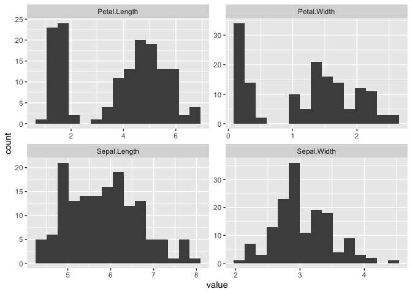
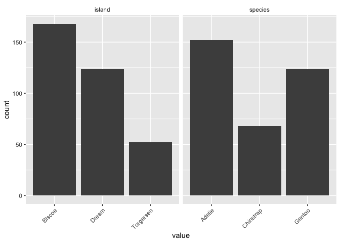
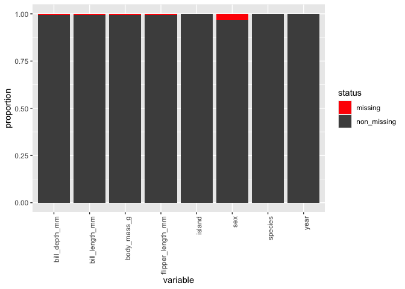
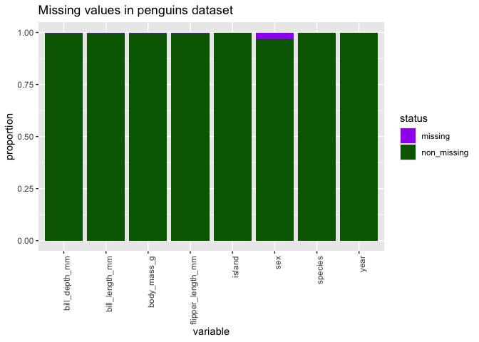

<!-- README.md is generated from README.Rmd. Please edit that file -->

# quickinspectR

<!-- badges: start -->

[](https://opensource.org/licenses/MIT)

<!-- badges: end -->

The goal of *quickinspectR* is to make it easier (and quicker) for
beginner R programmers to graphically inspect their data. The package is
centered around an expanding collection of simple `inspect_...`
functions that help users visualize their data.

Currently, this package supports:

- `inspect_normality`: graphically inspect the distribution of numeric
  variables in your data.
- `inspect_balance`: graphically inspect the class balance (or lack
  thereof) in your data.
- `inspect_missing`: graphically inspect missingness in your data.

## Installation

You can install the development version of quickinspectR from
[GitHub](https://github.com/andrewfullerton/quickinspectR) with:

``` r
# install.packages("devtools")
devtools::install_github("andrewfullerton/quickinspectR")
```

## Example

By design, all `inspect_...` functions require only one argument: a data
frame or a tibble (`data`). Unless otherwise specified, `quickinspectR`
functions will display all the relevant variables contained in the data
frame and default to easy-to-read plot styling. Here’s an example using
`inspect_normality`:

``` r
library(quickinspectR)

inspect_normality(iris)
```



If you want to specify the variables you wish to visualize, you can pass
a string of variables into an `inspect_...` function using the `vars`
argument. Here’s an example using `inspect_balance`:

``` r
inspect_balance(palmerpenguins::penguins, c("species", "island"))
```



To make plot customization easier when dealing with more complicated
*ggplot2* objects, some `inspect_...` functions contain additional
(optional) arguments. Here’s an example leveraging the `na_colour` and
`fill_colour` arguments in `inspect_missing` to customize the plot
outputs.

``` r
inspect_missing(data = palmerpenguins::penguins, 
                vars = c("species", "sex", "island"),
                na_colour = "purple", 
                fill_colour = "yellow")
```



And since all *quickinspectR* functions are built on top of ggplot2, you
can further customize your plot outputs by passing in additional
*ggplot2*-supported arguments. Here’s an example modifying the fill
colour transparency by passing `alpha = 0.3` into the `geom_bar` layer
under the hood.

``` r
inspect_missing(palmerpenguins::penguins, 
                c("species", "sex", "island"),
                alpha = 0.5)
```



## Thanks for checking out *quickinspectR*!
